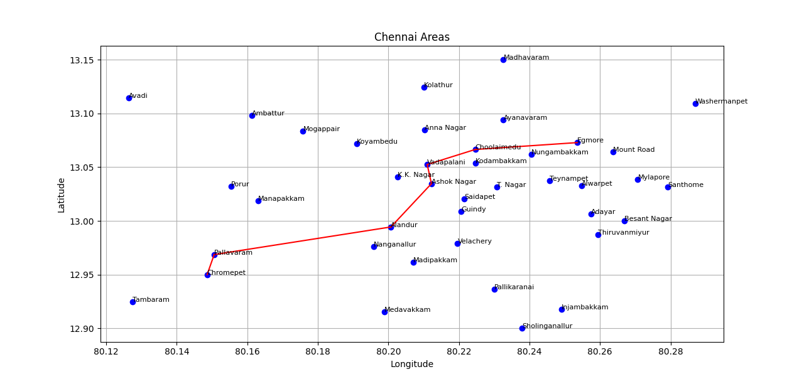

# Chennai Shortest Path

🌟 Implemented Dijkstra’s algorithm to find the shortest path between locations
in Chennai.

🌟 Utilized Python’s heapq module for efficient priority queue operations and
Matplotlib for visualizing the shortest path on a map.

🌟 Demonstrated problem-solving skills and proficiency in algorithm
implementation through real-world application.

## Output Snapshot

